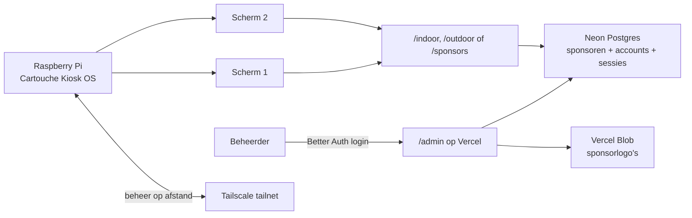

# Cartouche Kiosk

Dit repository bevat het complete narrowcasting-systeem voor HC Cartouche: het besturingssysteem voor de Raspberry Pi én de webapp die wedstrijden en sponsoren op de clubschermen toont.

Het systeem is bewust in één repository ondergebracht. Een toekomstige beheerder kan daardoor zowel de schermconfiguratie als de online contentlaag terugvinden zonder afhankelijk te zijn van kennis die alleen bij de oorspronkelijke ontwikkelaar aanwezig is.

## Onderdelen

| Map | Functie | Draait op |
| --- | --- | --- |
| [`kiosk-os`](./kiosk-os) | Bouwt een betrouwbaar, read-only Raspberry Pi kiosk-image met ondersteuning voor meerdere schermen en Tailscale | Raspberry Pi bij HC Cartouche |
| [`webapp`](./webapp) | Next.js-webapp met `/indoor`, `/outdoor`, `/sponsors` en beveiligd sponsorbeheer op `/admin` | Vercel, team **ADEMA Group** |

## Architectuur



De Raspberry Pi bevat geen sponsorcontent. Hij opent alleen de ingestelde webpagina’s in losse Chromium-vensters. Sponsorrecords staan in Neon; de publieke logo-afbeeldingen staan in Vercel Blob. Daardoor kan een beheerder content aanpassen zonder fysiek bij de Pi te zijn.

## Productieomgevingen en eigenaarschap

- Vercel-project: `adema-group/cartouche-kiosk`
- Productie-URL: [cartouche-kiosk.vercel.app](https://cartouche-kiosk.vercel.app)
- Neon-project: `cartouche-dome`, regio Frankfurt (`aws-eu-central-1`)
- Vercel Blob-store: `cartouche-sponsors`, regio Frankfurt (`fra1`), publieke leesmodus
- GitHub-repository: `quintenadema/CartoucheKiosk`
- Oorspronkelijk technisch beheer: Quinten Adema / ADEMA Group

Geheime waarden staan uitsluitend in Vercel Environment Variables of in lokale, door Git genegeerde `.env.local`-bestanden. Zet nooit databasewachtwoorden, Better Auth-secrets, Blob-tokens of Tailscale auth keys in Git.

## Snel lokaal starten

Voor JavaScript wordt in dit project Bun gebruikt.

```bash
cd webapp
bun install
bunx --bun vercel@latest link --project cartouche-kiosk --scope adema-group
bunx --bun vercel@latest env pull .env.local --environment=development
bun run dev
```

Open daarna [localhost:3000/indoor](http://localhost:3000/indoor), [localhost:3000/outdoor](http://localhost:3000/outdoor), [localhost:3000/sponsors](http://localhost:3000/sponsors) of [localhost:3000/admin](http://localhost:3000/admin).

Meer informatie over databasebeheer, het aanmaken van beheerders en deployments staat in [`webapp/README.md`](./webapp/README.md).

## Een Raspberry Pi in gebruik nemen

1. Bouw of download een image volgens [`kiosk-os/README.md`](./kiosk-os/README.md).
2. Flash het image naar een degelijke SD-kaart of USB-SSD.
3. Open de FAT-configuratiepartitie en pas `kioskbrowser.ini` aan:
   - Cartouche-hostname en tijdzone;
   - wifi of ethernet;
   - één `[screenN]`-blok per scherm;
   - één `[browserN]`-blok per webpagina.
4. Voeg voor remote beheer een eenmalige Tailscale auth key toe zoals beschreven in de Kiosk OS README.
5. Start de Pi, controleer beide schermen en noteer de Tailscale-naam in de technische administratie van de club.

## Regulier beheer

- Sponsor toevoegen of wijzigen: log in op `/admin`.
- Wedstrijdschermen controleren: open `/indoor` en `/outdoor` rechtstreeks in een normale browser.
- Pi bereiken: gebruik het Tailscale-IP of de MagicDNS-naam en SSH als gebruiker `pi`.
- Kioskconfiguratie wijzigen: pas `kioskbrowser.ini` op de bootpartitie aan en herstart de Pi.
- Nieuwe webversie uitrollen: push naar de gekoppelde GitHub-branch of voer vanuit `webapp` een Vercel-deployment uit.

## Overdracht aan een nieuwe beheerder

Geef een opvolger toegang tot de volgende vier omgevingen; alleen toegang tot GitHub is niet voldoende:

1. GitHub-repository `quintenadema/CartoucheKiosk`;
2. Vercel-team **ADEMA Group** en project `cartouche-kiosk`;
3. Neon-organisatie en project `cartouche-dome`;
4. de Tailscale tailnet waarin de kiosk-Pi is opgenomen.

Controleer bij overdracht ook `ADMIN_EMAILS` in Vercel. Alleen e-mailadressen uit die komma-gescheiden lijst krijgen toegang tot `/admin`, óók als er al een Better Auth-account bestaat.

## Storingen in het kort

| Probleem | Eerste controles |
| --- | --- |
| Beide schermen zijn zwart | Voeding, HDMI, Pi-status en `systemctl status lightdm` via SSH |
| Eén scherm is verkeerd geplaatst | Outputnamen met `xrandr`; vergelijk met `[screenN]` en `[browserN]` |
| Sponsorpagina is leeg | Vercel runtime logs, `DATABASE_URL`, Neon-status en tabel `sponsors` |
| Logo-upload faalt | `BLOB_READ_WRITE_TOKEN`, Blob-storekoppeling en bestandstype/grootte |
| `/admin` blijft naar login sturen | Better Auth-tabellen, `BETTER_AUTH_SECRET`, `BETTER_AUTH_URL` en `ADMIN_EMAILS` |
| Pi niet via Tailscale bereikbaar | `systemctl status kiosk-tailscale tailscaled` en `tailscale status` |

Gedetailleerde procedures staan in de README van het betreffende onderdeel.
